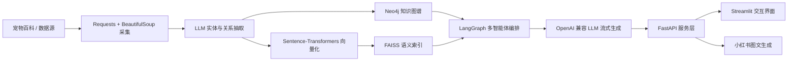

# 宠知通 · PetKG 宠物知识图谱智能平台

[](https://python.org)
[](https://www.langchain.com/langgraph)
[](https://neo4j.com)
[](https://github.com/facebookresearch/faiss)
[](https://fastapi.tiangolo.com)
[](https://streamlit.io)

> **PetKG 是一套面向宠物养护场景的知识图谱 + 多智能体 LLM 应用**，覆盖「数据采集 → 实体关系抽取 → 图谱构建 → 语义向量索引 → 多智能体检索与生成 → Web 交互 / 小红书图文创作」的完整闭环。项目将宠物食品、宠物食谱等非结构化文本沉淀为可查询、可推理、可解释的知识网络，并以图增强检索（Graph-enhanced Retrieval）支撑专业问答。

## ✨ 核心亮点

- **全链路知识工程**：从公开数据爬取、LLM 结构化抽取、Neo4j 建图到语义索引，形成标准化的领域知识生产流水线。
- **图增强问答**：结合 Neo4j Cypher 精确查询与 FAISS 向量相似度召回，兼顾事实准确性与语义泛化能力。
- **LangGraph 多智能体编排**：通过显式状态图串联意图识别、实体消歧、图谱检索、答案融合等多个专业 Agent，推理路径清晰可追踪。
- **流式响应与多轮记忆**：FastAPI 提供 SSE/纯文本流式输出，前端支持会话历史注入与多轮追问。
- **业务场景延伸**：在知识问答之外内置小红书宠物图文生成链路，可输出标题、正文与配图，保留内容创作扩展能力。

## 🧭 技术架构



系统采用 **领域数据层 → 知识表示层 → 检索推理层 → 服务交互层** 的分层设计：底层用 Neo4j 表达实体关系语义，中层用 FAISS 补齐向量召回，上层用 LangGraph 对多个 Agent 做条件路由与状态管理。

## 📋 项目简介

本项目以宠物食品和宠物食谱为初始知识域，构建完整的宠物知识图谱，并围绕图谱提供智能检索、专业问答与内容创作能力：

- 🕷️ **数据采集**：自动爬取宠物食品与食谱的列表、详情和结构化字段
- 🧠 **实体抽取**：基于 LLM 提取实体属性及疾病、症状、功效等关系
- 📊 **图谱构建**：将结构化知识写入 Neo4j，形成多类型节点与关系网络
- 🔍 **语义检索**：Sentence-Transformers + FAISS 对疾病、症状、功效实体建立向量索引
- 🤖 **多智能体推理**：LangGraph 路由意图，动态选择 Cypher 查询或 LLM 直接回答
- 💻 **服务与交互**：FastAPI 提供流式 API，Streamlit 提供多轮对话与图文生成界面

## 🏗️ 项目架构

```
PetKG/
├── __001__crawler/                         # 数据采集模块
│   ├── __000__获取网页内容通用方法.py
│   ├── __001__get_recipe_menu_list.py      # 宠物食谱列表获取
│   ├── __002__get_recipe_detail_info.py    # 宠物食谱详情获取
│   ├── __003__get_petfood_menu_list.py     # 宠物食品列表获取
│   └── __004__get_petfood_detail_list.py   # 宠物食品详情获取
├── __002__extract_entity_relation/         # 实体关系抽取模块
│   ├── __001__extract_recipe_entity.py     # 宠物食谱实体抽取
│   ├── __002__extract_petfood_entity.py    # 宠物食品实体抽取
│   ├── __003__extract_recipe_entity_relation_detail.py
│   ├── __004__extract_petfood_entity_relation_detail.py
│   └── __005__parse_recipe_source.py
├── __003__create_neo4j/                    # Neo4j 图数据库构建
│   ├── __001__create_recipe_entity.py      # 宠物食谱实体创建
│   ├── __002__create_petfood_entity.py     # 宠物食品实体创建
│   ├── __003__create_recipe_relation.py    # 宠物食谱关系创建
│   └── __004__create_petfood_relation.py   # 宠物食品关系创建
├── __004__langgraph_agent/                 # 图谱检索代理与向量嵌入
│   ├── __001__get_neo4j_json.py
│   ├── __002__disease_symptom_embedding_out.py
│   ├── __003__effect_embedding_out.py
│   ├── __004__langgraph_more_agent.py      # 主代理逻辑
│   ├── agent_state.py                      # 代理状态管理
│   ├── pet_metadata.json                   # 宠物图谱 schema
│   └── my_agents/                          # 各种专业代理
│       ├── pet_question_classifier_agent.py
│       ├── symptom_or_disease_checker_agent.py
│       ├── symptom_or_disease_entity_embedding_matcher_agent.py
│       ├── effect_checker_agent.py
│       ├── effect_entity_embedding_matcher_agent.py
│       ├── cypher_query_generator_agent.py
│       ├── direct_llm_answer_agent.py
│       ├── final_answer_mixer_agent.py
│       ├── xiaohongshu_intent_classifier_agent.py
│       ├── xiaohongshu_pet_post_output_agent.py
│       └── xiaohongshu_image_generator_agent.py
├── __005__fastapi/                         # FastAPI 服务
│   ├── my_fastapi.py
│   └── my_fastapi_test.py
├── __006__streamlit/                       # Web 应用界面
│   ├── __001__streamlit_chat_page.py       # 聊天界面
│   └── __002__auto_publish_xiaohongshu.py  # 小红书自动发布示例
├── common/                                 # 公共模块
│   ├── config.py                           # 环境配置读取（.env）
│   ├── embedding_model.py
│   ├── llm.py
│   └── neo4j_client.py
├── tools/
│   └── path_utils.py                       # 路径工具
├── data/                                   # 宠物示例数据集
│   ├── 宠物食品/                           # 宠物食品详情文件
│   ├── 宠物食谱/                           # 宠物食谱详情文件
│   ├── 宠物食品列表.xlsx / .csv
│   └── 宠物食谱列表.xlsx / .csv
├── main.py                                 # 主程序入口（启动 Streamlit）
├── requirements.txt                        # 核心 Python 依赖
├── docker-compose.yml                      # Neo4j 与向量检索中间件
├── config.ini.example
├── .env.example
└── .gitignore
```

## 🚀 快速开始

### 一键启动

项目已配置为开箱即用，本机无需 Docker，也无需手动启动 Neo4j：

```powershell
git clone <你的仓库地址> PetKG
cd PetKG
Copy-Item .env.example .env
# 编辑 .env，填入自己的 LLM Key；如已有独立 Conda 环境，可设置 PETKG_PYTHON
$env:PETKG_PYTHON = "D:\path\to\python.exe"
```

1. 双击 `启动PetKG.bat`
2. 等待脚本依次启动 Neo4j、FastAPI、Streamlit
3. 浏览器自动打开 `http://127.0.0.1:8501`

也可以在当前目录执行：

```powershell
powershell.exe -NoProfile -ExecutionPolicy Bypass -File .\start.ps1
```

停止服务请双击 `停止PetKG.bat`。

原入口 `python main.py` 仍可用于只启动 Streamlit，但需先确保 Neo4j 与 FastAPI 已在运行。

### 启动项说明

- Python 环境：优先读取 `PETKG_PYTHON`；未设置时读取本地忽略文件 `runtime\python-path.txt`，最后回退到系统 `python`
- Neo4j：`runtime\neo4j-community-4.4.41`
- JDK：`runtime\jdk-11.0.32.1+1`
- FastAPI：`http://127.0.0.1:8000`
- Streamlit：`http://127.0.0.1:8501`

`start.ps1` 会自动设置 `PYTHONPATH`、`SSL_CERT_FILE`、`NO_PROXY` 和 Neo4j 所需环境变量，并写入 `runtime\logs` 日志目录。

> 注意：`runtime/` 包含 Neo4j、JDK 与本地数据库文件，体积较大且不适合提交到 Git，因此仓库默认忽略该目录。克隆后请将本地运行时目录放入 `runtime/`，或按 `docker-compose.yml` 自行准备中间件。

## 📖 功能模块详解

### 1. 数据采集 (`__001__crawler`)

负责从宠物百科网站采集数据：

- **宠物食谱数据采集**：获取食谱列表和详细信息
- **宠物食品数据采集**：获取食品列表和详细信息
- **数据存储**：以 Excel 和文本文件形式保存原始数据

### 2. 实体关系抽取 (`__002__extract_entity_relation`)

使用大语言模型从原始文本中抽取结构化信息：

- **宠物食品实体抽取**：名称、别名、品牌、产地、主要成分、适用宠物、功效等
- **宠物食谱实体抽取**：食谱名、组成、功效、适用症状、做法等
- **关系抽取**：宠物食品/食谱与疾病、症状、功效之间的关系

### 3. 知识图谱构建 (`__003__create_neo4j`)

将结构化数据导入 Neo4j 图数据库：

- **实体节点创建**：宠物食品、宠物食谱、疾病、症状、功效、营养特点、生命阶段等节点
- **关系边创建**：调理、包含、适用、缓解等关系
- **图谱优化**：索引创建和数据验证

### 4. 图谱智能探索 (`__004__langgraph_agent`)

基于 LangGraph 构建的多代理图谱检索系统：

- **问题分类代理**：判断是否为宠物领域问题
- **实体识别代理**：识别症状、疾病、功效等实体
- **知识检索代理**：从知识图谱中检索相关信息
- **答案生成代理**：综合信息生成最终答案

### 5. Web 界面 (`__006__streamlit`)

基于 Streamlit 的用户交互界面，支持多轮对话、流式响应与小红书自动发布。

## 🧪 示例查询

- "狗狗掉毛应该吃什么？"
- "化毛膏的作用是什么？"
- "肠胃不适的猫咪适合什么食谱？"
- "幼犬补钙吃什么好？"

## 📊 图谱 Schema

| 实体标签 | 说明 |
| --- | --- |
| `PetFood` | 宠物食品/营养品 |
| `PetRecipe` | 宠物食谱 |
| `Disease` | 宠物疾病 |
| `Symptom` | 宠物症状 |
| `Effect` | 功效 |
| `PetType` | 适用宠物类型 |
| `NutritionType` | 营养特点 |
| `LifeStage` | 适用生命阶段 |
| `EffectCategory` / `PetFoodCategory` / `PetRecipeCategory` / `Source` | 分类与出处 |

## 🔧 技术栈

| 层级 | 核心技术 | 项目中的作用 |
| --- | --- | --- |
| 数据采集 | `Requests` + `BeautifulSoup` | 爬取宠物食品、食谱列表与详情，并持久化为 CSV/XLSX/文本 |
| 数据处理 | `Pandas` / `openpyxl` | 清洗、合并与校验抽取结果，产出结构化知识表 |
| 大模型 | `LangChain Core` + `langchain-openai` | 接入 OpenAI 兼容 LLM，完成实体抽取、意图识别与流式生成 |
| 智能体编排 | `LangGraph` | 以状态图组织多 Agent，实现条件路由、上下文传递与可观测推理链路 |
| 图数据库 | `Neo4j` | 存储多类型实体与关系，支持 Cypher 精确查询和图谱推理 |
| 语义检索 | `Sentence-Transformers` + `FAISS` | 对疾病、症状、功效等实体构建向量索引，支撑语义消歧与召回 |
| 服务层 | `FastAPI` + `Uvicorn` | 提供同步、流式与小图文生成 API，采用 Pydantic 模型校验 |
| 交互层 | `Streamlit` | 构建多轮对话、历史会话管理与小红书内容创作界面 |
| 内容发布 | `Playwright` + `volcengine` | 浏览器自动化发布与即梦文生图配图生成（可选模块） |

## ⚠️ 免责声明

本系统提供的宠物养护信息仅供参考，宠物出现疾病症状时请及时咨询专业兽医。

## 📞 联系方式

如有问题或建议，请提交 GitHub Issue 或联系项目维护者。
